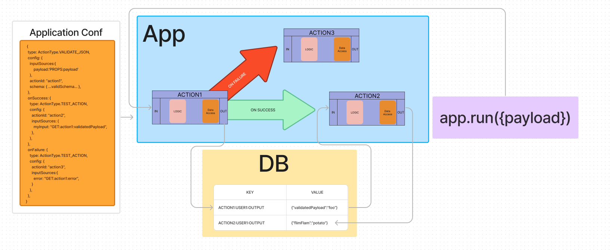

# Application System

The application system allows for JSON to specify the composition of logical
components feeding outputs into inputs, and allowing for basic flow control.



## getting started

1. start dynamo locally `docker-compose up`
2. run the test suite 
``` 
DYNAMO_ENDPOINT=http://localhost:8000 APP_ENV=local APP_NAME=test npm run test
```

## <a name="Application"></a> Application

The broadest concept of an the application system is the un-ironically named
[Application](#Application) object. This object instance holds a linked-list of [Actions](#Action) which it will execute in sequence defined in an [ApplicationConfiguration JSON document](#ApplicationConfiguration).

Applications have a single public method `run()` which will first instantiate all [Action](#Action) objects defined in the [ApplicationConfiguration](#ApplicationConfiguration) as a lined list, then traverse the list executing the `invoke` method with the `input` specified in the `<action>.config.inputSources`.

<center></center>

## <a name="globals"></a> Globals

While each [Action](#action) has it's own memory space, there are a read-only set of globals, which are accessible from within any action via `this.globals.<whatever>`. These may be accessed at any time.

## <a name="action"></a> Actions

All actions are subclasses of the `Action` class.


<center></center>

---


### <a name="ApplicationConfiguration"></a> ApplicationConfiguration JSON

The `applicationConfiguration` must follow a rigid nested/recursive structure and is the same for all [Actions](#action).
Each Application must have the following root-level keys:

```json
{
  "type": "MyActionType",
  "config": {
    "actionId": "uniqueVal",
    ...
  },
  "inputSources": {
    "whatever": "GLOBAL:accountId",
  },
  "onSuccess": {
    ...
  }
}

```

| key                 | required | type   | description                                                                                                                 |
| ------------------- | -------- | ------ | --------------------------------------------------------------------------------------------------------------------------- |
| type                | true     | string | This value maps to the action types |
| config              | true     | string | The config object specific to the `type`. See [Action](#action) documentation for details.                                  |
| config.actionId     | true     | string | The unique name of this action within this application.                                                                     |
| config.inputSources | false    | object | An Object, keyed by a desired input param name, and valued by a string. See [InputSources](#input-sources) for more details |
| onSuccess           | false    | object | An ApplicationConfiguration to run if/after this action fails                                                               |
| hooks               | false    | object | Some applications may offer custom behavior midway thru execution. See Action documentation for details.                    |

## Input Sources

Each Action has it's own output which may be referenced from `inputSources`.

To reference the output of one action as the input to another, simply link them with the `config.inputSources` object.

Here is an example:

```json
// Example Bulk Check-In ApplicationConfig
// Note the inputSources sections which link memory address' for runtime hydration.
{
  "type": "BulkCheckIn",
  "config": {
    "actionId": "root",
    "streakInterval": 86400000,
    "rewardEachCheckIn": true
  },
  "inputSources": {
    "accountId": "GLOBAL:accountId",
    "claimedAddresses": "GLOBAL:claimedAddresses"
  },
  "onSuccess": {
    "type": "Mint",
    "config": {
      "actionId": "mint",
      "inputSources": {
        "walletAddress": "GLOBAL:walletAddress",
        "nftIdsAndQuantities": "GET:root:nftIdsAndQuantities" // <-- output of root, as input to mint
      }
    }
  }
}
```


## Actions

### VerifyPayload
This action validates JSON against the JSON schema specified in the config section of the ApplicationConfiguration for this action. To use this action the following parameters must be met:

1. `config.inputSources.payload` must reference an object that can stringify to valid JSON. 
1. `config.schema` must be a valid JSON schema. 

In the event that `payload` is not valid JSON a `BAD_REQUEST` runtime exception will be surfaced as output, and the onFailure hook will be called. To reference the runtime exception in a subsequent Action reference the `error` property of the `VERIFY_PAYLOAD` action's output.

#### Example `VERIFY_PAYLOAD` Configuration:
```ts
{
    type: ActionType.VERIFY_PAYLOAD,
    config: {
        inputSources:{
            payload:'PROPS:payload'
        },
        actionId: "act1",
        schema: {...validJSONschema...},
    } as VerifyPayloadConfiguration,
    onFailure: {
        type: ActionType.TEST_ACTION,
        config: {
            actionId: "onFailureAction",
            inputSources:{
                error: "GET:act1:error",
            }
        } as TestActionConfiguration,
    }
}
```