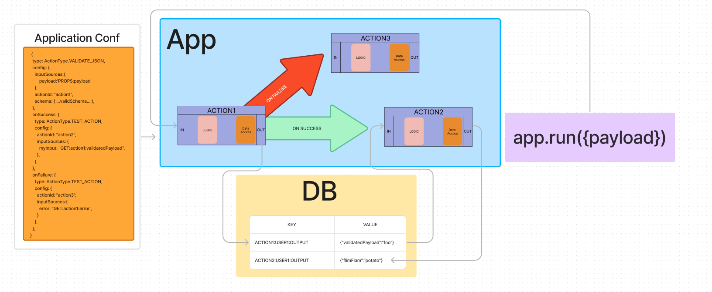

# Application System



## Actions

### VerifyPayload
This action validates JSON against the JSON schema specified in the config section of the ApplicationConfiguration for this action. To use this action the following parameters must be met:

1. `config.inputSources.payload` must reference an object that can stringify to valid JSON. 
1. `config.schema` must be a valid JSON schema. 

In the event that `payload` is not valid JSON a `BAD_REQUEST` runtime exception will be surfaced as output, and the onFailure hook will be called. To reference the runtime exception in a subsequent Action reference the `error` property of the `VERIFY_PAYLOAD` action's output.

#### Example `VERIFY_PAYLOAD` Configuration:
```ts
{
    type: ActionType.VERIFY_PAYLOAD,
    config: {
        inputSources:{
            payload:'PROPS:payload'
        },
        actionId: "act1",
        schema: {...validJSONschema...},
    } as VerifyPayloadConfiguration,
    onFailure: {
        type: ActionType.TEST_ACTION,
        config: {
            actionId: "onFailureAction",
            inputSources:{
                error: "GET:act1:error",
            }
        } as TestActionConfiguration,
    }
}
```
